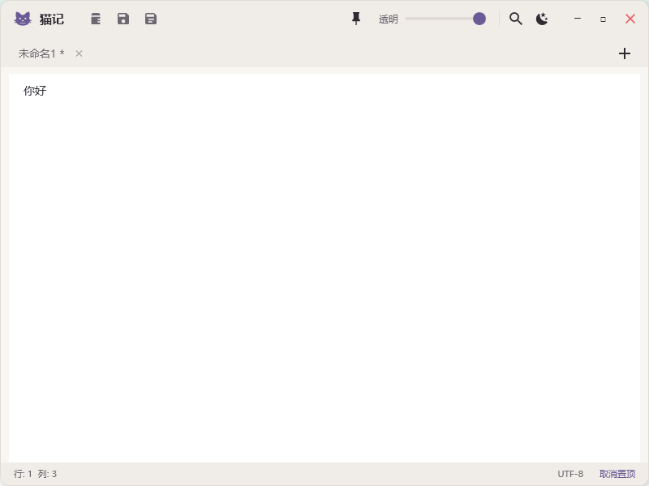

# 🐱 猫记 (MaoJi)

<p align="center">
  
</p>

<p align="center">
  <b>一个轻量级、现代化的 Windows 记事本应用</b>
</p>

<p align="center">
  <a href="https://github.com/victorzhupro/MaoJi/releases">
    
  </a>
  <a href="https://github.com/victorzhupro/MaoJi/releases/latest">
    
  </a>
  
  
</p>

---

## 📖 项目介绍

**猫记 (MaoJi)** 是一款基于 WPF 和 .NET 8 开发的轻量化记事本应用。它旨在提供比系统自带记事本更现代的体验，同时保持极致的轻量和高性能。

无论你是需要临时记录灵感，还是进行简单的文本编辑，猫记都能为你提供清爽、无干扰的写作环境。

## 📸 应用预览



## ✨ 主要功能

- **📝 多标签页支持**：像浏览器一样管理多个文档，轻松切换。
- **🌓 深色/浅色主题**：内置优雅的明亮与暗黑模式，一键切换，呵护您的双眼。
- **📌 窗口置顶**：一键置顶窗口，方便参考资料或进行多任务处理。
- **🌫️ 透明度调节**：可调节窗口透明度，打造个性化的桌面挂件体验。
- **🚀 独立部署**：
  - 单文件绿色部署，内置 .NET Runtime。
  - **开箱即用**，无需安装任何依赖。
  - 压缩包体积约 **60 MB**。

## 🛠️ 技术栈与实现

本项目采用现代化的 .NET 技术栈构建：

- **开发框架**: [.NET 8](https://dotnet.microsoft.com/) + [WPF](https://docs.microsoft.com/zh-cn/dotnet/desktop/wpf/)
- **架构模式**: MVVM (Model-View-ViewModel)
- **核心库**:
  - `CommunityToolkit.Mvvm`: 高效的 MVVM 架构支持。
  - `Hardcodet.NotifyIcon.Wpf`: 系统托盘图标支持。
  - `System.Text.Json`: 高性能 JSON 序列化/反序列化。
- **UI 实现**:
  - 纯 XAML 矢量图标（无位图依赖）。
  - 自定义窗口样式（无边框、圆角、阴影）。
  - Win32 API 互操作（实现强力置顶、窗口拖拽）。

## 🏗️ 项目架构

```
MaoJi/
├── Assets/             # 静态资源（图标等）
├── Converters/         # WPF 值转换器 (Value Converters)
├── Models/             # 数据模型 (NoteTab, AppSettings)
├── Services/           # 核心服务层
│   ├── AutoSaveService.cs  # 自动保存逻辑
│   ├── FileService.cs      # 文件 I/O 操作
│   ├── SettingsService.cs  # 配置持久化
│   └── ThemeService.cs     # 主题切换逻辑
├── ViewModels/         # 视图模型 (MainViewModel)
├── Views/              # 视图层 (RenameDialog等)
├── App.xaml            # 应用程序入口与资源字典
├── MainWindow.xaml     # 主窗口 UI 定义
└── build_installer.ps1 # 自动化构建脚本
```

## 🚀 快速开始

### 📥 下载安装

1. 前往 [Releases](https://github.com/victorzhupro/MaoJi/releases) 页面。
2. 下载最新版本的 `MaoJi.zip` (绿色版) 或 `MaoJi_Setup.exe` (安装版)。
3. 解压或安装后即可运行（已内置运行环境，无需额外安装）。

### 💻 源码构建

如果您想自己编译项目：

1. 克隆仓库：
   ```bash
   git clone https://github.com/victorzhupro/MaoJi.git
   ```
2. 使用 Visual Studio 2022 打开 `MaoJi.csproj`。
3. 或者使用命令行构建：
   ```powershell
   # 运行构建脚本生成发布包
   .\build_installer.ps1
   ```

## 📈 Star History

[](https://star-history.com/#victorzhupro/MaoJi&Date)

---

<p align="center">
  Made with ❤️ by Victor zhu
</p>
